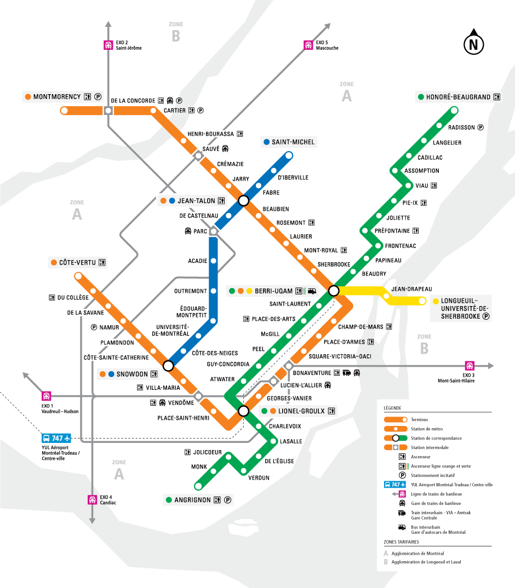
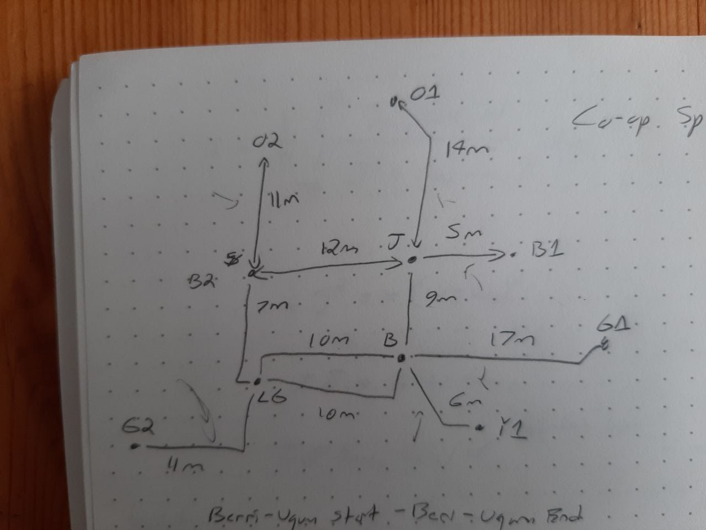

```{r setup, include=FALSE}
knitr::opts_chunk$set(echo = TRUE)
library(tidyverse)
speed2022 <- readxl::read_excel("Metro Speedrun Tracking 2022.xlsx")
speed2022 <- speed2022 %>% 
  select(`TIME TRACKING`, `Estimated Time`, `Actual Time`) %>% 
  mutate(
    `Estimated Time` = hms::as_hms(`Estimated Time`),
    `Actual Time` = hms::as_hms(`Actual Time`)
  )
```

## Initial thoughts: focus on one group

It is best to start at the longest extremity to minimize the amount of distance that is doubled over.



For 2022, this meant beginning at **Angrinon**, transfer at **Berri-UQAM**, up to **Cote-Vertu**, the entire Blue line, up to **Montmorency**, down to the **Berri-UQAM** once more, a lil hop on the yellow, and then finally to **Honore-Beaugrand**. See the time predictions below.

```{r Speed2022, echo=FALSE}
tibble(speed2022)
```

## Co-op Rules
1. A team must all begin in the same place.
2. A team must all end in the same place.
  - People are allowed to leave the speedrun part way through, if they desire
3. A team cannot divide into more groups than allowed.
4. Each station a group visits contributes to their group total.
5. Time begins when the first member of a team boards a train.
6. Time ends when the group is all together (and all stations have been visted).
7. For our purposes, we will begin at Berri-UQAM
  - Aside: I believe that the more ideal starting place would have been an extremity like **Honore-Beaugrand**, particularly in a two group run, but may make less snese in a three group or larger run (effectively more group time is used on this leg).

## Two-group team approach
  For our situation, this would have two competing teams. Find below Laura's table of times for each segment:



```{r times, echo=FALSE}
segments <- c("JT-O1", "JT-B1", "JT-B2", "JT-BQ", "B2-O2", "B2-LG", "LG-BQ_gr", "LG-BQ_or", "BQ-Y1", "BQ-G1", "LG-G2")
# Two letter/digit abbreviations for each transfer point, including termini
times <- c(14, 5, 12, 9, 11, 7, 10, 10, 6, 17, 11)
# Times in minutes, provided by transit. I think these are rounded?
legs <- tibble(segments, times)
# Putting them together in a cute lil tibble
legs
```

The main time sink is and will be the **Honore-Beaugrand** leg, taking `r times[10]` minutes. Following from prior years, it would be ideal to minimize transfers as they are inherently time losses. There is also the matter ending in the same place! Arg.

Assuming no transfer time (teleporting between each and every train) and no double back, we could make it in `r sum(times)/2` minutes.

Let us eliminate the isolated branches extending from Berri-UQAM:
```{r 2group1}
group1 <- times[10]*2 + 3
  # To Honore-Beaugrand and back, plus the typical 3 minute reversal time
group2 <- times[9]*2 + 3
  # To Longeuil and back, plus reversal
```

If the team already on the green line continues, we can avoid another transfer. Let us have the other group continue to **Montmorency**. 
```{r 2group2}
group1 <- group1 + times[7] + times[11]*2 + 3
  # Intial time, BQ-LG, LG to Angrinon and back, and a 3 minute reversal time
group2 <- group2 + 9 + times[4] + times[1]*2 + 3
  # This takes the initial time, a maximum 9 minute transfer, JT-BQ, JT-O1*2 to double back to Jean-Talon, and a 3 minute reversal time
```

Our groups are now at **Lionel-Groulx** in `r group1` minutes and **Jean-Talon** `r group2` minutes, respectively. For ease of meeting, I think it could be ideal to have *Group 2* take the Orange line segment between **Lionel-Groulx** and **Berri-UQAM**, which would add `r times[8]*2 + 9` minutes with the least opportune transfer, putting *Group 2* at `r group2 + times[8]*2 + 9` minutes at **Jean-Talon**. I think this is the best solution, let's run with it further.

With this now great disparity in time, *Group 1* has plenty of time to take the western side to **Cote-Vertu** and down to Snowdon.
```{r 2group3}
group1 <- group1 + 9 + times[6] + times[5]*2 + 3
  # Intial time plus max transfer plus LG->Snowdon plus Snowdon->Cote-Vertu*2 plus train turnaround time
group2 <- group2 + times[8]*2 + 9
  # Catching up to the calculations just made above
```

Now our groups are **Snowdon** and **Jean Talon**, at `r group1` and `r group2` minutes respectively, a `r group1 - group2` minute difference. Providing the trip from **Jean Talon** to **Saint-Michel** will eliminate this difference:
```{r 2group4}
group2 <- group2 + 9 + times[2]*2 + 3
  # Initial time plus worst transfer plus time to Saint-Michel and back, plus turn around time.
```

Now *Group 2* is at **Jean-Talon** going Westbound at `r group2` minutes, while *Group 1* is at **Snowdon** at `r group1` minutes. Even with the worst transfer time of 9 minutes (total `r group1 + 9`mins), the group will be able to meet halfway through the Blue line. Good communication will be necessary, but assuming half time of the leg between **Snowdon** and **Jean-Talon**, that would give a time of `r group2 + times[3]/2`-ish minutes.
```{r 2group5}
group1 <- group1 + 9 + times[3]/2 + 2
  # Worst transfer and halfway split plus two mins to meet other group
group2 <- group2 + times[3]/2 + 2
  # Just halfway split plus two mins to meet other group
```
This provides a difference of times of `r group1 - group2` minutes, with *Group 1* arriving at this hypothetical midpoint at `r group1` minutes and *Group 2* at `r group2` minutes. *Group 1* could likely travel an extra station or two, but this will rely heavily on good communication between the groups.

I feel that this is the ideal routing, maintaining an equivalence of times between the groups.

## Three-group team approach

I feel that the ideal approach will be to minimize initial transfers and then bringing the three groups back together will result in all parts of the metro being covered.
